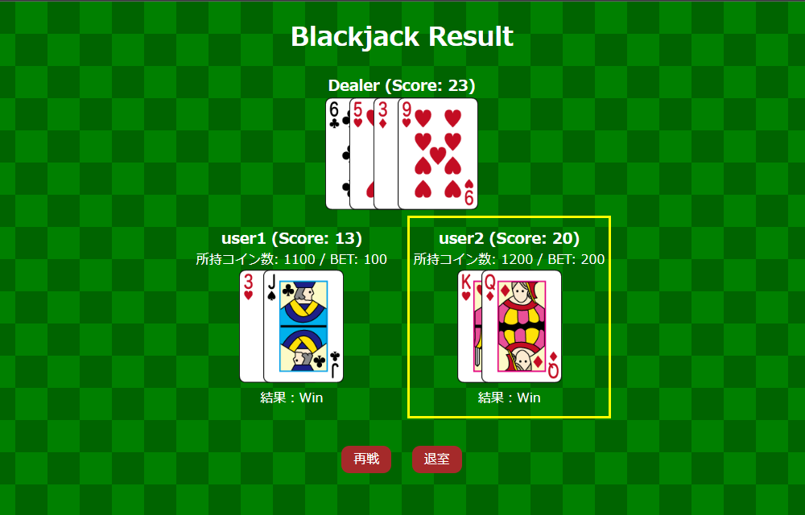
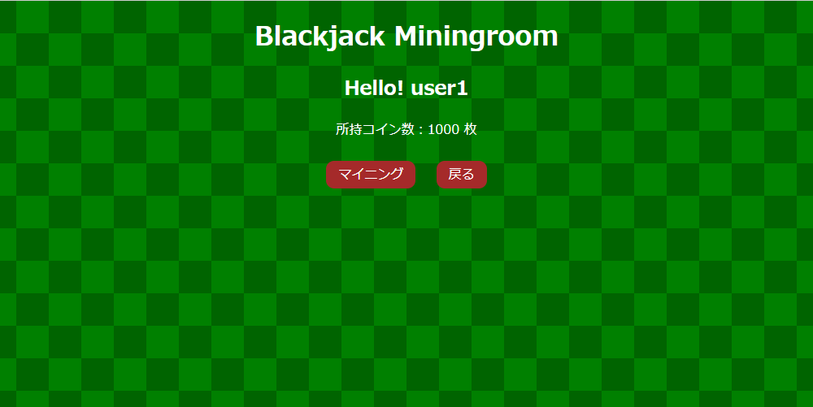

# 情報システム応用演習課題
# BlackJack
---
## ユーザマニュアル（管理者用）

### 目次
##### 0．[初めに](#anchor0)
##### 1．[トップ画面](#anchor1)
##### 2．[ルール説明画面](#anchor2)
##### 3．[ログイン画面](#anchor3)
##### 4．[ホーム画面](#anchor4)
##### 5．[ロビー画面](#anchor5)
##### 6．[ゲーム画面](#anchor6)
##### 7．[結果表示画面](#anchor7)
##### 8．[マイニング画面](#anchor8)
##### 9．[管理者画面](#anchor9)

---

#### ０．はじめに

このアプリケーションを利用する時はブラウザに備わっているbackボタン(左上の戻るボタン)は使用しないでください．予期せぬ動作をする場合があります．

#### １．トップ画面

このページでは以下の機能があります．

|  ボタン名  |  機能  |
| :--- | :--- |
|  ログイン  |  ログイン画面に遷移します．  |
|  ルール  |  ルール説明画面へ遷移します．(ログイン無し閲覧できます．)  |

#### ２．ルール説明画面

このページではブラックジャックのルール説明を書いています．

|  ボタン  |  機能  |
| :--- | :--- |
|  戻る  |  直前のページに遷移します．  |

#### ３．ログイン画面

このページは以下の機能があります．

|  空欄  |  入力  |
| :--- | :--- |
|  Username  |  利用するユーザ名を入力してください．  |
|  Password  |  パスワードを入力してください．  |

|  ボタン名  |  機能  |
| :--- | :--- |
|  Sign in  |  入力したユーザでログインしホーム画面へ遷移します．  |

利用できるユーザアカウントは以下の7種類です．
|  ユーザ名  |  パスワード  |
| :--- | :--- |
|  admin  |  p@ss  |
|  user1  |  p@ss  |
|  user2  |  p@ss  |
|  user3  |  p@ss  |
|  user4  |  p@ss  |
|  user5  |  p@ss  |
|  user6  |  p@ss  |

#### ４．ホーム画面

このページは以下の機能があります．

|  ボタン名  |  機能  |
| :--- | :--- |
|  入室  |  ロビー画面へ遷移します．  |
|  ルール  |  ルール説明画面へ遷移します．  |
|  マイニング  |  マイニング画面へ遷移します．  |
|  ログアウト  |  ログアウトし，トップ画面へ遷移します．  |
|  管理画面  |  管理画面へ遷移します．（＊管理者のみ表示されます．）  |

#### ５．ロビー画面

このページは以下の機能があります．

|  空欄  |  入力  |
| :--- | :--- |
|  ベット額を入力  |  賭けたいコインの枚数を入力してください．  |
＊ベットするコインの枚数が所持コインの枚数より多い場合は自動的に0枚ベットしたものとして処理されます．

|  ボタン名  |  機能  |
| :--- | :--- |
|  退室  |  退室しロビー画面へ遷移します．  |
|  ゲームスタート  |  入力したコインの枚数を賭けてゲームを開始します．  |

#### ６．ゲーム画面

黄色い線で囲まれたカードが自分の手札です．Scoreが21を超えないように気を付けながら21に近づけていきましょう．

このページは以下の機能があります．

|  ボタン名  |  機能  |
| :--- | :--- |
|  ヒット  |  ヒットしカードを1枚引きます．  |
|  スタンド  |  スタンドし現在の手札で勝負します．  |

#### ７．結果表示画面

黄色い線で囲まれたカードが自分の手札です．

このページはでは以下の機能があります．

|  ボタン名  |  機能  |
| :--- | :--- |
|  再戦  |  ロビー画面へ遷移します．  |
|  退室  |  退室し，ホーム画面へ遷移します．  |

#### ８．マイニング画面

このページは以下の機能があります．

|  ボタン名  |  機能  |
| :--- | :--- |
|  マイニング  |  コインをマイニングできます．(得られるコインの枚数は確率で変化します．)  |
|  戻る  |  ホーム画面へ遷移します．  |

#### ９．管理者画面

adminでログインしユーザのみが閲覧できます．
このページはでは以下の機能があります．

|  ボタン名  |  機能  |
| :--- | :--- |
|  全ユーザのコイン枚数を100枚にリセット  |  全ユーザのコイン枚数を100枚にします．  |
|  ルーム内のプレイヤーを全員退室  |  ルーム内のプレイヤーを全員退室させます．（全員がロビー画面にいない状態で実行してください．）  |
|  データベース更新  |  データベースを更新し表示される情報を最新のものにします．  |
|  戻る  |  ホーム画面へ遷移します．  |
